<p align="center">
  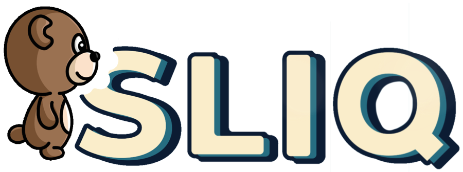
</p>

# SLIQ (Kivy prototype)

A falling-tile puzzle game for iOS, written in Python with Kivy: slide numbered tiles into a colour-matched border that rotates around the board.

> **Status: archived.** This is the 2024 Python/Kivy prototype, kept for reference. It is unfinished and no longer developed. It grew out of an [earlier Python mockup](https://github.com/BowerHarry/python-game) and has been superseded by a [native Swift rewrite](https://github.com/BowerHarry/sliq-iOS).

<p align="center">
  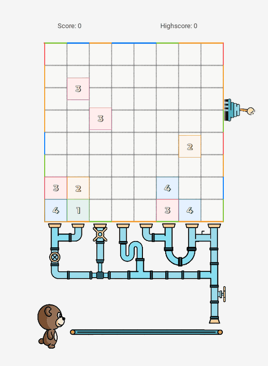
</p>

## Why it exists

SLIQ started as a puzzle game I imagined and mocked up in plain Python. This repo was the attempt to turn that into a real iOS game, with a plan to publish it on the App Store in 2024. I chose Kivy because the same Python code can, in theory, be deployed to iOS, Android and desktop; in practice the iOS toolchain builds were temperamental and took a lot of the effort.

## What it does

- An 8×8 board of tiles numbered 1–4. The number is both the tile's point value and how many moves it has left.
- Swipe a tile left or right. It slides one cell, loses one from its number, and falls under gravity.
- The board is surrounded by a coloured border. A tile that rests on, or is pushed into, a border segment of its own colour drops through and scores its value.
- A lever rotates the whole border a quarter turn and drops new tiles from the top. The border also rotates by itself every 20 seconds.
- Scored tiles travel through the pipes to a bear, which grows as you approach the target score.
- The round ends with a rating out of three bear heads, and the high score is saved between runs.

## Technical highlights

- **Sequenced animations as generators.** A small `yield_to_sleep` decorator turns a generator into a coroutine driven by Kivy's `Clock`, so multi-step sequences (slide, then fall, then update the grid) read as straight-line code with `yield 0.3` between steps instead of nested callbacks.
- **A rotating border built from two layers.** The game logic holds the border as a 10×10 grid and rotates it with `list(zip(*grid[::-1]))`. On screen, each of the four edges is drawn twice, and the eight strips slide 800 px at a time so the border appears to travel round the corners. One edge is regenerated with new colours on every rotation.
- **Retargeting tiles in mid-fall.** A newly dropped tile polls its landing column every 0.05 s. If the stack beneath it changes while it is falling, its animation is cancelled and restarted towards the new resting cell.
- **One codebase on desktop and iOS.** The same Python runs in a desktop window for development and is packaged for iOS with kivy-ios, with the high score stored in the app's user data directory on device.

**Stack:** Python, [Kivy](https://kivy.org) (including the kv layout language), [kivy-ios](https://github.com/kivy/kivy-ios) and Xcode for the iOS build.

Written by hand, without AI coding tools.

---

## How to play

### The board

Two things matter on screen: the tiles, and the coloured border around the board.

<p align="left">
  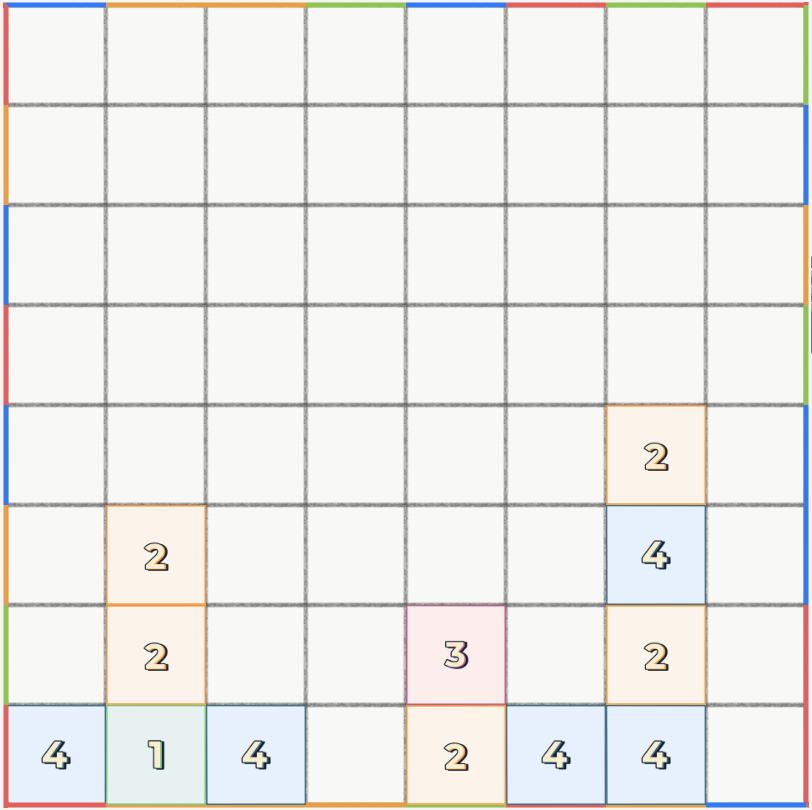
</p>

### Tiles

Each tile's number is its **value** and the **number of moves** it can still make. Each number has its own colour. A 0-tile cannot be moved and stays where it is for the rest of the round.

<p align="left">
  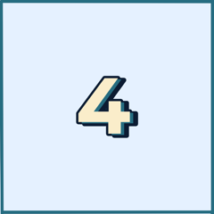
  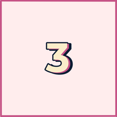
  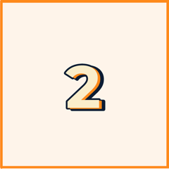
  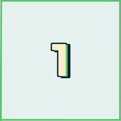
  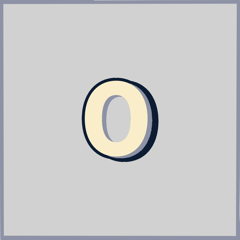
</p>

### Moving a tile

Swipe a tile left or right. Every move takes one off its number, which also changes its colour.

<p align="left">
  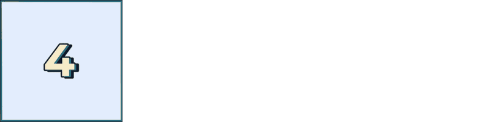
</p>

### Scoring

A tile scores when its colour matches the border segment it is touching.

Here a 4-tile sits on an orange (2) segment, so nothing happens. Moving it right turns it into a 3-tile above a red (3) segment: it falls through for **3 points**.

<p align="left">
  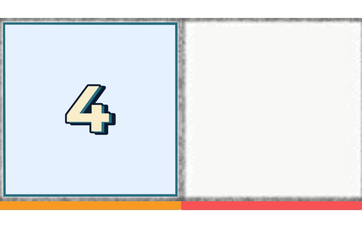
</p>

Side walls work too. This 2-tile does not match the floor, but the wall to its right is the same colour, so swiping it into the wall scores **2 points**.

<p align="left">
  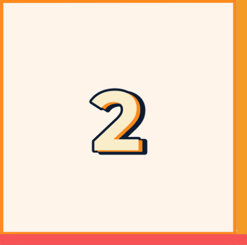
</p>

### Rotating the border

Pulling the lever rotates the whole border a quarter turn clockwise and drops new tiles from the top: two, plus more as the round goes on. The edge that passes the top-left corner is given new colours. If you leave the lever alone, the border rotates automatically after 20 seconds.

<p align="left">
  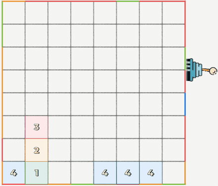
</p>

### Feeding the bear

Tiles that drop through the border come out of the pipes and roll along to the bear, which grows as your score approaches the target.

<p align="left">
  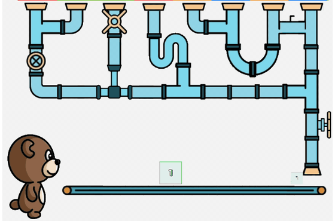
</p>

### Ending a round

The round is checked each time the border rotates. If a tile is sitting in the top row, the round is lost. Otherwise, if the score has reached the target, the round is won. Either way you are rated out of three bear heads: one for reaching 33% of the target, two for 65%, three for 100%.

<p align="left">
  
  
  
</p>

## Running it

### Requirements

- Python 3 with Kivy. Last checked with Python 3.13 and Kivy 2.3.1 on macOS; it was originally developed on Python 3.12.

### Desktop

```bash
git clone https://github.com/BowerHarry/sliq.git
cd sliq
python3 -m venv venv
source venv/bin/activate
pip install kivy
python main.py
```

The game starts straight into a round. Drag a tile sideways with the mouse to move it and click the lever to rotate the border. The high score is written to `leaderboard.json` in the working directory.

Expect the window to be the wrong size: see [Known limitations](#known-limitations).

### iOS

`sliq01-ios/` is the Xcode project that kivy-ios generated for this game in February 2024. It is a **reference snapshot and will not build from a clone**: it points at a local kivy-ios `dist` folder (Python, SDL2 and Kivy static libraries) through absolute paths that are not part of this repo. To build for iOS you would need to run the [kivy-ios](https://github.com/kivy/kivy-ios) toolchain yourself and create a fresh project from `main.py`.

## Project structure

| Path | What it is |
|---|---|
| `main.py` | App entry point. `SliqGameController` starts rounds, loads the high score and handles "Play again". |
| `game.py` | `SliqGame`: one round. Timers, the conveyor of scored tiles, the bear, win/lose and rating. |
| `board.py` | `Board` and `BoardTile`: swipe handling, moves, gravity, new tiles and scoring. |
| `border.py` | `Border` and `BorderEdge`: the border grid, its rotation and edge regeneration. |
| `sliq.kv` | Kivy layout for every screen element. |
| `src/` | Game art: tiles, border edges, pipes, lever, bear. Some files here are not used by the code. |
| `sliq01-ios/` | Generated Xcode project (snapshot, see above). |
| `docs/images/` | Images used in this README. |

## Tests

There are none.

## Known limitations

This is a prototype that stopped partway. In particular:

- **One round, no menus.** There are no levels, level select or freeplay mode. The target score is hardcoded to 10 in `main.py`, so a round can be won after the first rotation.
- **Fixed-pixel layout.** Positions and sizes in `sliq.kv` are hardcoded pixel values tuned for one window size (roughly 2880×1700 px). Other sizes are not laid out correctly.
- **Window size on Retina Macs.** `Window.size = Window.size` in `main.py` and `game.py` doubles the window on a HiDPI display, so it can open larger than the screen.
- **Tiles can overload a full board.** New tiles can be added when a column is already full ([issue 1](https://github.com/BowerHarry/sliq/issues/1)).
- **Moving into a tile that is still animating.** Moving a tile into another one less than about 0.2 s before its animation finishes gives inconsistent results ([issue 2](https://github.com/BowerHarry/sliq/issues/2)).
- **Double scoring.** A tile that matches the floor is sometimes scored more than once.
- **iOS project does not build** without a local kivy-ios toolchain, as described above.

## Credits

Built on [Kivy](https://kivy.org) and [kivy-ios](https://github.com/kivy/kivy-ios); the files in `sliq01-ios/` other than the game code come from the kivy-ios project template.

## License

MIT. See [LICENSE](LICENSE).
